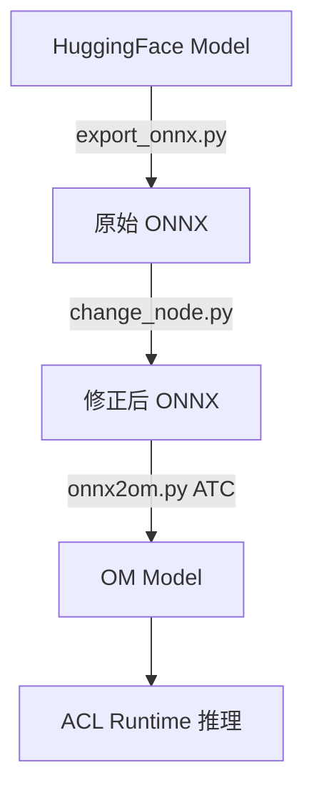

# DeepSeek-R1-Distill-Qwen-1.5B(Ascend 310B1)部署报告

## 1. 项目概述

DeepSeek-R1-Distill-Qwen-1.5B 在 Ascend 310B1 NPU 上的完整部署流程。

采用 **PyTorch → ONNX → OM** 的转换技术路线，实现高性能推理加速。


优点在于将运行时（Runtime）的开销，提前转移到编译时（Compile-time）。

缺点在于这个方案只适用于定长推理，

且属于芯片级别的适配，更换不同芯片（例如从310B1到310B4，对应了不同的soc_version），需要重新编译芯片适配的.om模型。

### 1.1 硬件与软件环境

**硬件配置：**
- **NPU**: Ascend 310B1（11577 MB 显存）
- **CPU**: ARM
- **操作系统**: Ubuntu 22.04 LTS (Kernel: Linux 6.6.0-72.0.0.76.h21510.1170.eulerosv2r15.ascend.aarch64)                                      
          

**软件环境：**
- **Python**: 3.10.20
- **关键依赖库**:
  - `torch==2.1.0` + `torch-npu==2.1.0.post6`
  - `onnx==1.16.1` + `onnxruntime==1.18.1`
  - `transformers==4.37.0`
  - Ascend CANN Toolkit (包含 ATC 编译器)

---

## 2. 技术路线总览

### 2.1 转换概览

```
HuggingFace PyTorch Model (原始格式)
         ↓
    ONNX Model (中间表示)
         ↓
    OM Model (Ascend优化格式)
```

1. **优化需求**: ONNX 提供标准化的计算图表示，便于硬件厂商进行算子融合、量化等优化
2. **部署效率**: OM (Offline Model) 格式是预编译的二进制格式，消除了运行时的图优化开销
3. **工具链**: Ascend 的 ATC (Ascend Tensor Compiler) 仅支持 ONNX/Caffe/TensorFlow 等标准格式作为输入

### 2.2 转换流程图



---

## 3. 第一阶段：魔改 Qwen2 模型结构

> 数学上的模型架构没有改变，改的是"计算图的形态"和"输入输出接口"，目的是让它能被**静态导出**成 ONNX/OM。权重与原始 HuggingFace checkpoint 完全兼容。

改造集中在 `export/modeling_qwen2.py`（基于 transformers v4.37.0 原版修改），属于**源码级的图工程改造（graph surgery at source level）**，而非架构创新。以下是一些改动情况：

### 3.1 接口签名

原版 `forward` 有十几个可选参数（`use_cache`、`inputs_embeds`、`output_attentions`、`return_dict`…）。`Qwen2ForCausalLM.forward` 只保留 4 个输入：

```python
def forward(self, input_ids, attention_mask, position_ids, past_key_values):
    ...
```

输出固定为 `(logits, out_key_values)`。这是因为 ONNX 导出要求**图的输入输出是固定张量**，不能有 Python 分支、可选参数或字典返回。

### 3.2 KV-cache：从"动态 tuple 列表"到"单个固定形状大张量"，避免动态内存分配：

- **原版 HF**：使用 `DynamicCache` / 每层一对 `(key, value)` 的 tuple 列表，长度随生成动态增长。
- **魔改版**：把整个 KV-cache 压成**一个四维张量**，形状为：

  ```
  (batch, kv_cache_length, num_layers * 2 * num_kv_heads, per_head_dim)
  ```

- 每层 attention 用**切片**从大张量取出本层的 key/value：

  ```python
  cache_key = past_key_value[
      :,
      self.layer_idx * 2 * self.num_key_value_heads : (self.layer_idx * 2 + 1) * self.num_key_value_heads
  ]
  cache_value = past_key_value[
      :,
      (self.layer_idx * 2 + 1) * self.num_key_value_heads : (self.layer_idx * 2 + 2) * self.num_key_value_heads
  ]
  key_states = torch.cat((cache_key, key_states), dim=2)
  value_states = torch.cat((cache_value, value_states), dim=2)
  ```

- 在 `Qwen2Model.forward` 里用 `transpose` + `concat` 把各层输出的 KV 重新拼回同一形状（`:1103, :1172-1176`）。

### 3.3 只保留 eager attention，删除 FlashAttention / SDPA 分支

保留最朴素的 matmul-softmax-matmul 版本，保证算子都能被 ATC 识别。

### 3.4 执行
```bash
torch.onnx.export(
    model,
    f=onnx_model_path,
    args=input_args,
    ...
    )
  ```

```bash
uv run export/export_onnx.py \
  --device_str=npu \
  --dtype=float16 \
  --hf_model_dir=/mnt/host-model/cxj/models/DeepSeek-R1-Distill-Qwen-1.5B \
  --onnx_model_path=./output/onnx/DeepSeek-R1-Distill-Qwen-1.5B_1024.onnx \
  --kv_cache_length=1024
```

---

## 4. 第二阶段：ONNX 算子修正

PyTorch 原生支持 torch.onnx.export，用于将模型从"Python代码 + 动态图"固化为一张静态且框架无关的计算图，作为 PyTorch 和昇腾 OM 之间的解耦桥梁。

### 4.1 核心脚本：`export/change_node.py`

Ascend 的 ATC 编译器对 ONNX 算子的实现与标准 ONNX Runtime 存在差异，需要手动适配。

#### (1) Trilu 算子修正
```python
if node.op_type == "Trilu":
    new_node = helper.make_node(
        "Trilu",
        name="MY_" + node.name,
        inputs=[node.input[0]],  # 移除第二个输入（k参数）
        outputs=node.output,
        upper=0  # 固定为下三角
    )
```

**问题**: PyTorch 导出的 `Trilu` 包含动态 `k` 参数（指定对角线位置），但 Ascend 要求 `k` 必须为常量

**解决**: 移除动态输入，将 `upper=0` 写入属性（生成下三角矩阵，用于 causal mask）


### 4.2 执行
```bash
uv run export/change_node.py \
  --input_model_path=./output/onnx/DeepSeek-R1-Distill-Qwen-1.5B_1024.onnx \
  --output_model_path=./output/onnx2/DeepSeek-R1-Distill-Qwen-1.5B_1024.onnx
```
---

## 5. 第三阶段：ONNX → OM 的编译

使用昇腾 CANN 的 **ATC（Ascend Tensor Compiler）** 命令行工具完成（`export/onnx2om.py` 本质拼了一条 `atc` 命令）。

### 5.1 技术路线

ATC 是一个**离线图编译器**：读入 ONNX 图 → 算子映射（映射到昇腾 AI Core 算子库）→ 图融合优化 → 内存规划 → 针对具体芯片型号生成二进制 OM 离线模型。

### 5.2 相关参数

```bash
atc --framework=5                          # 5 = ONNX 输入
    --model=<onnx>  --output=<om>
    --soc_version=Ascend310B1              # 芯片型号，强绑定
    --precision_mode_v2=mixed_float16      # 混合精度模式
    --modify_mixlist=ops_info.json         # 对个别算子做精度覆盖
    --input_format=ND
    --input_shape="input_ids:...;attention_mask:...;position_ids:...;past_key_values:..."
    --dynamic_dims="..."                   # 动态 shape 分档
```
```bash
<!-- 910上使用onnx转om完整命令，kv_cache_length=4096，max_prefill=8 -->
# 1. 配置环境变量 (开启 GE、设置并行编译核数以加速编译)
export MS_DEV_FORCE_ACL=1
export MS_ENABLE_GE=1
export TE_PARALLEL_COMPILER=64
export MAX_COMPILE_CORE_NUMBER=64

# 2. 执行 ATC (Ascend Tensor Compiler) 模型转换
atc \
  --framework=5 \
  --model="output/onnx2_DeepSeek-R1-Distill-Qwen-1.5B_4096_simplified_changenode/DeepSeek-R1-Distill-Qwen-1.5B_4096_rectified_sim.onnx" \
  --output="./output/model_910_cann900/DeepSeek-R1-Distill-Qwen-1.5B_4096_8" \
  --soc_version=Ascend910_9382 \
  --precision_mode_v2=mixed_float16 \
  --modify_mixlist="/mnt/host-model/cxj/qwen-ascend-llm/ops_info.json" \
  --input_format=ND \
  # -1表示动态维度，其余为静态维度
  # 1 = batch_size
  # 112 = num_hidden_layers × 2 × num_key_value_heads = 28 × 2 × 2 = 112
  # 128 = head_dim = hidden_size / num_attention_heads = 1536 / 12 = 128
  --input_shape="input_ids:1,-1;attention_mask:1,-1;position_ids:1,-1;past_key_values:1,-1,112,128" \
  # 动态分档，分别对应两档kv_cache和2的幂次的多个seq_length的组合
  # 以kv_cache_length=4096，max_prefill=8为例，预编译了8=2*4种shape的输入， 
  # input_ids; attention_mask; position_ids; past_key_values
  --dynamic_dims="1,2049,1,2048;
  2,2050,2,2048;
  4,2052,4,2048;
  8,2056,8,2048;
  1,4097,1,4096;
  2,4098,2,4096;
  4,4100,4,4096;
  8,4104,8,4096"
```


**Remark**

- **`--framework=5`**：指定输入是 ONNX。
- **`--soc_version`**：脚本用 `ctypes` 调 `libruntime.so` 的 `rtGetSocVersion` **自动探测芯片型号**（也可手动指定）。这是 OM 不可移植的根源——OM 与芯片型号绑死。
- **`--precision_mode_v2=mixed_float16` + `modify_mixlist`**：整体混合精度加速，同时用 `ops_info.json` 白名单让个别对精度敏感的算子保持高精度，避免 fp16 溢出。


### 5.3 动态 shape 分档

脚本按 `max_prefill_length`（必须是 2 的幂）生成 `[1, 2, 4, ..., max_prefill_length]` 的 prefill 档位，组合成多档 shape：

```python
for dynamic_kv_cache_length in [kv_cache_length // 2, kv_cache_length]:
    for dynamic_dim in zip(input_ids_length_range, position_length_range):
        new_dynamic_dim = [
            str(dynamic_dim[0]),                            # input_ids
            str(dynamic_dim[0] + dynamic_kv_cache_length),  # attention_mask
            str(dynamic_dim[1]),                            # position_ids
            str(dynamic_kv_cache_length),                   # past_key_values
        ]
        dynamic_dims.append(",".join(new_dynamic_dim))
```
**Remark**
运行时 AclSession.decompose_number 把任意输入长度分解成已注册档位的组合（如输入 12 → [8, 4]）逐段推理，从而在降低首字延迟（大 prefill 档一次处理多个 token，减少execute调用次数）与编译成本（档位越多，atc 编译越慢、OM 文件越大）之间取得平衡。若 max_prefill_length=1，则 OM 只注册了seq=1单个档位，prefill退化为逐token执行，与decode阶段行为一致，输入有多少个token就要forward多少次，当prompts很长时，首字延迟会比较大。

以 prompt_len=11为例，

| max_prefill_length | 分解结果 | forward次数 |
|--------------------|----------------------|---------------|
| 1                  | [1,1,1,1,1,1,1,1,1,1,1] | 11|
| 4                  | [4,4,2,1] | 4  |
| 8                  | [8,2,1] | 3|


### 5.4 执行
```bash
uv run export/onnx2om.py \
  --hf_model_dir=/mnt/host-model/cxj/models/DeepSeek-R1-Distill-Qwen-1.5B \
  --onnx_model_path=./output/onnx2/DeepSeek-R1-Distill-Qwen-1.5B_1024.onnx \
  --om_model_path=./output/model/DeepSeek-R1-Distill-Qwen-1.5B_1024_4 \
  --kv_cache_length=1024 \
  --cpu_thread=8 \
  --max_prefill_length=4 \
  --soc_version=Ascend310B1
```

**输出**: 
- `DeepSeek-R1-Distill-Qwen-1.5B_1024_4.om` - 编译后的二进制模型

---

## 6. 推理阶段：ACL Runtime

### 6.1 运行时架构

```python
from utils.session import AclSession
from utils.inference import Inference

session = AclSession(
    om_model_path="./output/model/DeepSeek-R1-Distill-Qwen-1.5B_1024_4",
    max_prefill_length=4,
    kv_cache_length=1024
)

inference = Inference(session=session, tokenizer=tokenizer)
for token in inference.stream_infer(prompt):
    print(token, end='', flush=True)
```


## 7. 存在问题

1. **KV-Cache 长度不可变**
   - 必须满足：`max_input_length + max_output_length ≤ kv_cache_length`
   - 修改需重新导出 ONNX 和编译 OM


2. **动态shape限制**
   - `max_prefill_length` 必须为 2 的幂次
   - 这个值较大时会显著增加编译时间，并增大内存占用

3. **更换芯片必须重新适配并编译对应om文件**

---

## 8. 完整部署流程

### 8.1 一键执行脚本：`scripts/run_test.sh`

```bash
#!/bin/bash
MODEL_NAME="DeepSeek-R1-Distill-Qwen-1.5B"
HF_MODEL_DIR="/mnt/host-model/cxj/models/${MODEL_NAME}"
KV_CACHE_LENGTH=1024
MAX_PREFILL_LENGTH=4

# 阶段1: 导出 ONNX
uv run export/export_onnx.py \
  --device_str=npu --dtype=float16 \
  --hf_model_dir=$HF_MODEL_DIR \
  --onnx_model_path="./output/onnx/${MODEL_NAME}_${KV_CACHE_LENGTH}.onnx" \
  --kv_cache_length=$KV_CACHE_LENGTH

# 阶段2: 算子修正
uv run export/change_node.py \
  --input_model_path="./output/onnx/${MODEL_NAME}_${KV_CACHE_LENGTH}.onnx" \
  --output_model_path="./output/onnx2/${MODEL_NAME}_${KV_CACHE_LENGTH}.onnx"

# 阶段3: 编译 OM
uv run export/onnx2om.py \
  --hf_model_dir=$HF_MODEL_DIR \
  --onnx_model_path="./output/onnx2/${MODEL_NAME}_${KV_CACHE_LENGTH}.onnx" \
  --om_model_path="./output/model/${MODEL_NAME}_${KV_CACHE_LENGTH}_${MAX_PREFILL_LENGTH}" \
  --kv_cache_length=$KV_CACHE_LENGTH \
  --max_prefill_length=$MAX_PREFILL_LENGTH \
  --soc_version=Ascend310B1
```

### 8.2 推理测试

```bash
uv run cli_chat.py \
  --session_type=acl \
  --hf_model_dir=/mnt/host-model/cxj/models/DeepSeek-R1-Distill-Qwen-1.5B \
  --om_model_path=./output/model/DeepSeek-R1-Distill-Qwen-1.5B_1024_4 \
  --max_input_length=1024 \
  --max_output_length=2048 \
  --max_prefill_length=4

```
---


## 9 性能测试

### 9.1 Inference_Performance (kv_cache_length = 4096, max_prefill_length = 1)

| Input(tok) | Output(tok) | TTFT(s) | TPOT(ms) | Speed(tok/s) | Peak VRAM(MB) |
|------------|-------------|---------|----------|--------------|---------------|
| 512        | 128         | 137.435 | 322.8    | 3.1          | 7338          |
| 1024       | 128         | 275.217 | 322.8    | 3.1          | 7355          |
| 2048       | 128         | 550.402 | 323.2    | 3.09         | 7352          |
| 256        | 256         | 69.541  | 324.3    | 3.08         | 7210          |
| 512        | 256         | 137.803 | 324.3    | 3.08         | 7250          |
| 1024       | 256         | 276.147 | 324.8    | 3.08         | 7227          |
| 2048       | 256         | 551.392 | 324.5    | 3.08         | 7227          |
| 256        | 512         | 69.463  | 326.7    | 3.06         | 7353          |
| 512        | 512         | 137.591 | 326.6    | 3.06         | 7358          |
| 1024       | 512         | 275.957 | 327.1    | 3.06         | 7364          |
| 2048       | 512         | 551.202 | 327.2    | 3.06         | 7366          |

### 9.2 Math-500 Benchmark (kv_cache_len = 32768, max_prefill_length = 1)

**Configuration**

| Configuration | Value |
|---------------|-------|
| system\_prompt | False |
| temperature   | 0.6   |
| top\_p         | 0.95  |
| max_input         | 1024  |
| max_output         | 31744  |

| Chip | Test Cases | Accuracy | Correct / Total |
|------------|------------|----------|-----------------|
| 910        | 42         | 0.7619   | 32/42           |
| 310        | 42         | 0.7619   | 32/42           |

**By Subject**

| Subject | 910 | 310 | Consistency | Consistent / Total |
|---------|-----|-----|-------------|--------------------|
| Algebra | 0.7778(7/9) | 0.7778(7/9) | 1.0000 | 9/9 |
| Counting & Probability | 0.7500(3/4) | 0.7500(3/4) | 1.0000 | 4/4 |
| Geometry | 0.7500(3/4) | 0.7500(3/4) | 1.0000 | 4/4 |
| Intermediate Algebra | 0.5714(4/7) | 0.5714(4/7) | 1.0000 | 7/7 |
| Number Theory | 1.0000(7/7) | 1.0000(7/7) | 1.0000 | 7/7 |
| Prealgebra | 0.6000(3/5) | 0.6000(3/5) | 1.0000 | 5/5 |
| Precalculus | 0.8333(5/6) | 0.8333(5/6) | 1.0000 | 6/6 |

**By Level**
| Level | 910 | 310 | Consistency | Consistent / Total |
|-------|-----|-----|-------------|--------------------|
| Level 1 | 0.7500(3/4) | 0.7500(3/4) | 1.0000 | 4/4 |
| Level 2 | 0.8000(8/10) | 0.8000(8/10) | 1.0000 | 10/10 |
| Level 3 | 1.0000(11/11) | 1.0000(11/11) | 1.0000 | 11/11 |
| Level 4 | 0.7143(5/7) | 0.7143(5/7) | 1.0000 | 7/7 |
| Level 5 | 0.5000(5/10) | 0.5000(5/10) | 1.0000 | 10/10 |

**Mismatch Items(3/42)**

| File | 910| 310 |
| :--- | :--- | :--- |
| `test/geometry/434.json` | 112 | 26 |
| `test/intermediate_algebra/1197.json` | $\frac{1}{9}$ | |
| `test/intermediate_algebra/1388.json` | 1 | -2 |


## 9.3 Full 500 Problems on Ascend 910
### Overall Metric
pass@1 (k=1): 0.7580 (379/500)

### pass@1 by Subject
| Subject | pass@1 | Correct / Total |
|---------|-----------------|-----------------|
| Algebra | 0.9032 | 112/124 |
| Counting & Probability | 0.6579 | 25/38 |
| Geometry | 0.5122 | 21/41 |
| Intermediate Algebra | 0.7010 | 68/97 |
| Number Theory | 0.8710 | 54/62 |
| Prealgebra | 0.7927 | 65/82 |
| Precalculus | 0.6071 | 34/56 |

### pass@1 by Level
| Level | pass@1| Correct / Total |
|-------|-----------------|-----------------|
| Level 1 | 0.8605 | 37/43 |
| Level 2 | 0.8333 | 75/90 |
| Level 3 | 0.8476 | 89/105 |
| Level 4 | 0.7266 | 93/128 |
| Level 5 | 0.6343 | 85/134 |

---

- **Ascend CANN 文档**: https://www.hiascend.com/document
- **ONNX 算子参考**: https://onnx.ai/onnx/operators/